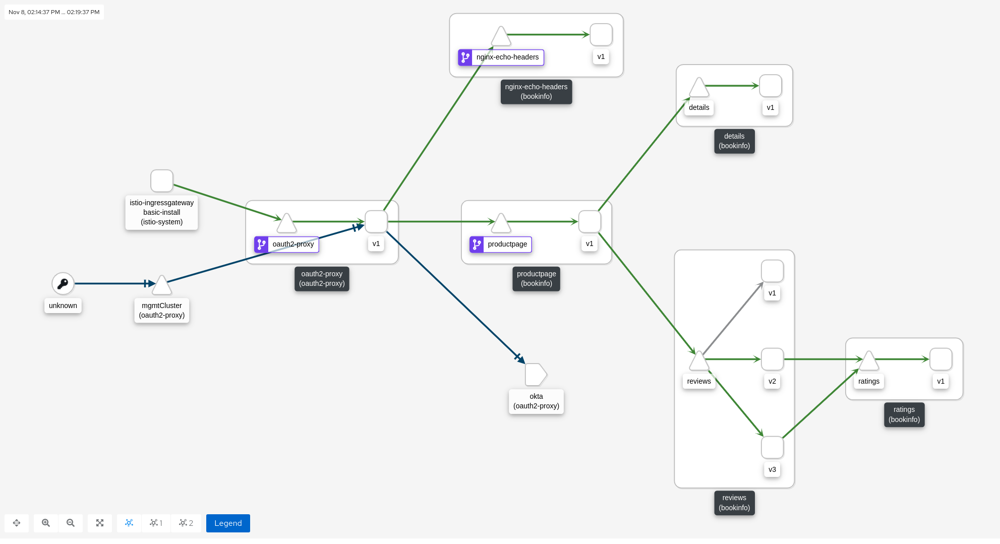

# Authentication and Authorization w/mTLS & JWT

> Note: OSSM 2.0 requires OCP 4.6+

See [Security](https://istio.io/v1.6/docs/reference/config/security/)

This example demonstrates request (JWT) and peer (mTLS) authentication & authorization to the bookinfo app's productpage and nginx-echo-headers services. A non-wildcard certificate created by cert-manager is presented by the ingressgateway and an Openshift Route uses passthrough tls termination so that no traffic into the mesh is unencrypted. Only requests originating from the oauth2-proxy service with a valid JWT will be authorized to each application. The oauth2 proxy service will pass the authorization header to the productpage or nginx-echo-headers services after the user logs into Okta (required for request authentication). mTLS is handled for us by Istio (required for peer authentication).

Additionally, we are adding headers to the request using an EnvoyFilter to demonstrate the JWT claims, request auth principal and source principal. These headers can be viewed by the nginx-echo-headers service.



> Note: since productpage won't natively propagate the authroization header, we can't use the same authorization policies on other upstream services (reviews, details, ratings).

## Install Operators

```sh
helm upgrade -i service-mesh-operators helm/service-mesh-operators -n openshift-operators
```

## Setup

Follow the steps described within [Configuring the OIDC Provider with Okta](https://github.com/trevorbox/oauth2-proxy/blob/update-okta-doc/docs/2_auth.md#configuring-the-oidc-provider-with-okta) to create an Okta application & authorization server. Retrieve its `client_id` and `client_secret`.

> Note: the Okta Application needs the login redirect URI to match the ${redirect_url} defined below.

```sh
export istio_system_namespace=istio-system
export apps_namespace=bookinfo
export client_id=<your client_id>
export client_secret=<your client_secret>
export base_domain=$(oc get Ingress.v1.config.openshift.io -o jsonpath={.items[0].spec.domain})
export redirect_url="https://api-${istio_system_namespace}.${base_domain}/oauth2/callback"
export oidc_issuer_url=https://dev-338970.okta.com/oauth2/default
```

## Install Cert Manager for Passthrough route TLS

```sh
oc new-project istio-system
helm repo add jetstack https://charts.jetstack.io
helm repo update
helm install cert-manager jetstack/cert-manager \
  --namespace cert-manager \
  --version v1.6.1 \
  --create-namespace \
  --set installCRDs=true
```

## Create certificate for ingressgateway

```sh
helm upgrade -i --create-namespace -n ${istio_system_namespace} cert-manager-certs helm/cert-manager --set ingressgateway.cert.commonName=api-${istio_system_namespace}.${base_domain}
```

## Deploy Control Plane

```sh
helm upgrade -i control-plane --create-namespace -n ${istio_system_namespace} helm/control-plane \
  --set control_plane.ingressgateway.host=api-${istio_system_namespace}.${base_domain}
```

Wait until the control plane is up...

## Deploy oauth2-proxy

This will deploy the oauth2-proxy and its istio configurations into the mesh. The nginx-echo headers and bookinfo apps will only be accessible from the oauth2-proxy service, ensuring the authentication flow for browsers.

> Note: we also create a dummy k8s service called oauth2-proxy-upstream to create a dns entry that the oauth2-proxy forwards to. Applications that need oauth2 support have VirtualService(s) that match on this host + uri paths.

```sh
helm upgrade --create-namespace -i oauth2-proxy-istio helm/oauth2-proxy-istio -n oauth2-proxy \
  --set control_plane.ingressgateway.host=$(oc get route api -n ${istio_system_namespace} -o jsonpath={'.spec.host'}) 
  
helm upgrade --create-namespace -i oauth2-proxy helm/oauth2-proxy -n oauth2-proxy \
  --set client_id=${client_id} \
  --set client_secret=${client_secret} \
  --set redirect_url=${redirect_url} \
  --set cookie_secret=$(cat /dev/urandom | tr -dc 'a-zA-Z0-9' | fold -w 32 | head -n 1)
```

## Deploy application istio configs

```sh
helm upgrade --create-namespace -i apps-istio helm/apps-istio -n ${apps_namespace} --set control_plane.ingressgateway.host=$(oc get route api -n ${istio_system_namespace} -o jsonpath={'.spec.host'}) --set control_plane.namespace=${istio_system_namespace} --set oidc_issuer_url=${oidc_issuer_url}
```

## Deploy apps

```sh
helm upgrade --create-namespace -i apps helm/apps -n ${apps_namespace}
```

## Verify

### Verify Authentication & Authentication for Requests and Peers works

Bookinfo should work because it passed the JWT auth header after authenticating from the oauth2-proxy...

```sh
echo "Open this page: https://$(oc get route api -n ${istio_system_namespace} -o jsonpath={'.spec.host'})/productpage"
```

Requests from the ratings pod without a valid JWT should return `403 Forbidden`...

```sh
oc exec deploy/ratings-v1 -c ratings -n ${apps_namespace} -i -t -- /bin/bash -c "curl -I http://productpage:9080"
```

You can try changing the AuthorizationPolicy's `source.principals` to something other than the oauth2-proxy's service account to demonstrate forbidden access from the oauth2-proxy pod with a valid JWT as well. For example change authorizationpolicy-productpage.yaml to the following, run the helm upgrade command to redeploy the istio configs, and then open the bookinfo page again.

```yaml
---
apiVersion: security.istio.io/v1beta1
kind: AuthorizationPolicy
metadata:
  name: productpage
spec:
  selector:
    matchLabels:
      app: productpage
  rules:
  - from:
    # Require a valid jwt for all requests from a fake service account only
    - source:
        requestPrincipals:
          - "*"
        principals:
          - "my_fake_principal"
...
```

You can also enable debug level logs on the sidecar for more info...

```sh
istioctl pc log $(oc get pod -l app=productpage -n ${apps_namespace} -o jsonpath='{.items[0].metadata.name}') --level debug -n ${apps_namespace}
```

### Verify custom headers passed to the nginx-echo-headers container

Since we deployed the echo headers app we can directly see what headers are finally passed to the application container by just accessing the page in the browser...

```sh
echo Open this page: https://api-${istio_system_namespace}.${base_domain}/nginx-echo-headers
```

Enable the info logs on the nginx-echo-headers sidecar to view the same additional headers in the sidecar logs...

```sh
istioctl pc log $(oc get pod -l app=nginx-echo-headers -n ${apps_namespace} -o jsonpath='{.items[0].metadata.name}') --level info -n ${apps_namespace}
```

### Client Credentials

> Create a scope called blackbox and a claim called blackbox assigned to the blackbox scope in Okta Security -> API dashboard.

This is an example...

```sh
export access_token=$(curl --request POST \
  --url https://dev-338970.okta.com/oauth2/default/v1/token \
  --header 'accept: application/json' \
  --header 'cache-control: no-cache' \
  --header 'content-type: application/x-www-form-urlencoded' \
  --data "grant_type=client_credentials&scope=blackbox&client_id=${client_id}&client_secret=${client_secret}" | jq -r '.access_token')

curl -k \
  --header "Authorization: Bearer ${access_token}" \
  https://api-${istio_system_namespace}.${base_domain}/nginx-echo-headers
```