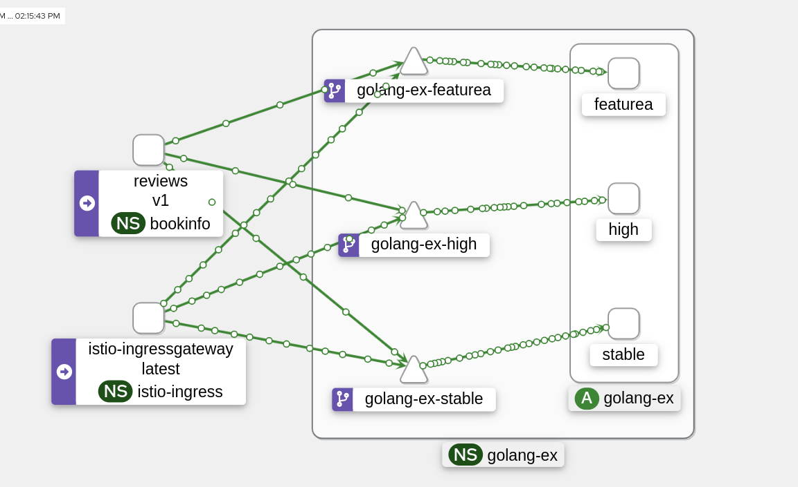

# Secure Ingress Gateway

> new: https://www.redhat.com/en/blog/preparing-openshift-service-mesh-3?channel=/en/blog/channel/hybrid-cloud-infrastructure

This example demonstrates:

- An Openshift passthrough route to an ingress gateway that presents a cert-manager certificate using SDS.
- Deploying an ingress gateway using gateway injection
- ClusterWide OSSM 2.5 deployment
- TempoStack
- Service Mesh deployment configuration that uses openshift-monitoing to store metrics for use by Kiali and Grafana
- Deploying an application multiple times and matching headers to route traffic (external and internal)

```sh
oc apply -f configmap-cluster-monitoring-config.yaml -n openshift-monitoring
helm upgrade -i namespaces helm/namespaces -n default

oc new-project cert-manager-operator
oc adm new-project openshift-tempo-operator
helm upgrade -i service-mesh-operators -n openshift-operators helm/service-mesh-operators --create-namespace

export istio_system_namespace=istio-system
export istio_ingress_namespace=istio-ingress

helm upgrade -i -n ${istio_ingress_namespace} cert-manager-certs helm/cert-manager 

helm upgrade -i control-plane -n ${istio_system_namespace} helm/control-plane

helm upgrade -i minio-operator helm/minio-operator/ -n minio-operator --create-namespace

helm upgrade -i minio-tenant helm/minio-tenant/ -n minio-tenant --create-namespace

helm upgrade -i tempo-system helm/tempo -n tempo-system --create-namespace

# use a proxy for authenticating using openshift to the tempo-frontend
helm upgrade -i jaeger-ui-proxy helm/openshift-oauth-proxy/ -n tempo-system --set upstream=http://tempo-minio-dev-query-frontend.tempo-system.svc.cluster.local:16686 --set cookieSecret=$(openssl rand -base64 32 | tr -- '+/' '-_') --set fullnameOverride=jaeger-ui-proxy

helm upgrade -i istio-ingressgateway helm/gateway -n ${istio_ingress_namespace}

# create istio configs for many feature deployments for golang-ex
helm upgrade -i golang-ex-istio helm/golang-ex-istio -n golang-ex

# deploy golang-ex three different times to emulate feature deplyoments
helm upgrade -i golang-ex-stable helm/golang-ex -n golang-ex --set version=stable --set fullnameOverride=golang-ex-stable
helm upgrade -i golang-ex-high helm/golang-ex -n golang-ex --set version=high --set fullnameOverride=golang-ex-high
helm upgrade -i golang-ex-featurea helm/golang-ex -n golang-ex --set version=featurea --set fullnameOverride=golang-ex-featurea

# TODO seems like grafana will no longer be supported (and istio's grafana dashboards)
helm upgrade -i grafana-operator -n openshift-operators helm/grafana-operator

helm upgrade -i grafana -n ${istio_system_namespace} helm/grafana

helm upgrade -i user-workload-monitoring helm/user-workload-monitoring -n ${istio_system_namespace} \
  --set kiali.tempo.url=https://$(oc get route tempo-minio-dev-query-frontend -n tempo-system -o jsonpath={.spec.host}) \
  --set kiali.grafana.url=https://$(oc get route grafana-instance-route -n ${istio_system_namespace} -o jsonpath={.spec.host})
```

## Install nginx-echo-headers Istio Configs

```sh
helm upgrade -i nginx-echo-headers-istio helm/nginx-echo-headers-istio -n nginx-echo-headers --set ingressgateway.host=nginx-echo-headers-${istio_ingress_namespace}.$(oc get ingress.config.openshift.io cluster -o jsonpath={.spec.domain})
```

## Install nginx-echo-headers

```sh
helm upgrade -i nginx-echo-headers helm/nginx-echo-headers -n nginx-echo-headers
```

## Install Bookinfo Istio Configs

```sh
helm upgrade -i bookinfo-istio helm/bookinfo-istio -n bookinfo --set ingressgateway.host=bookinfo-${istio_ingress_namespace}.$(oc get ingress.config.openshift.io cluster -o jsonpath={.spec.domain})
```

## Install Bookinfo

```sh
helm upgrade -i bookinfo helm/bookinfo -n bookinfo
```

## Testing



```sh
# test header matching from a bookinfo service that has curl
oc exec -n bookinfo deploy/reviews-v1  -c reviews -- bash -c "for i in {1..500}; do curl -v -H \"x-feature: golang-ex/stable\" http://golang-ex.golang-ex.svc.cluster.local:8080; done"
oc exec -n bookinfo deploy/reviews-v1  -c reviews -- bash -c "for i in {1..500}; do curl -v -H \"x-feature: golang-ex/high\" http://golang-ex.golang-ex.svc.cluster.local:8080; done"
oc exec -n bookinfo deploy/reviews-v1  -c reviews -- bash -c "for i in {1..500}; do curl -v -H \"x-feature: golang-ex/featurea\" http://golang-ex.golang-ex.svc.cluster.local:8080; done"
# should still default to routing to stable without any header
oc exec -n bookinfo deploy/reviews-v1  -c reviews -- bash -c "for i in {1..500}; do curl -v http://golang-ex.golang-ex.svc.cluster.local:8080; done"

# test ocp routes
siege -c 10 -r 100 https://golang-ex-${istio_ingress_namespace}.$(oc get ingress.config.openshift.io cluster -o jsonpath={.spec.domain})
# test header matching on stable route
siege -c 10 -r 100 -H "x-feature: golang-ex/featurea" https://golang-ex-${istio_ingress_namespace}.$(oc get ingress.config.openshift.io cluster -o jsonpath={.spec.domain})
# other routes
siege -c 10 -r 100 https://golang-ex-high-${istio_ingress_namespace}.$(oc get ingress.config.openshift.io cluster -o jsonpath={.spec.domain})
siege -c 10 -r 100 https://golang-ex-featurea-${istio_ingress_namespace}.$(oc get ingress.config.openshift.io cluster -o jsonpath={.spec.domain})
```

## OCP install notes

```sh
aws configure
openshift-install create install-config --dir ./openshift-install
openshift-install create cluster --dir ./openshift-install
```
